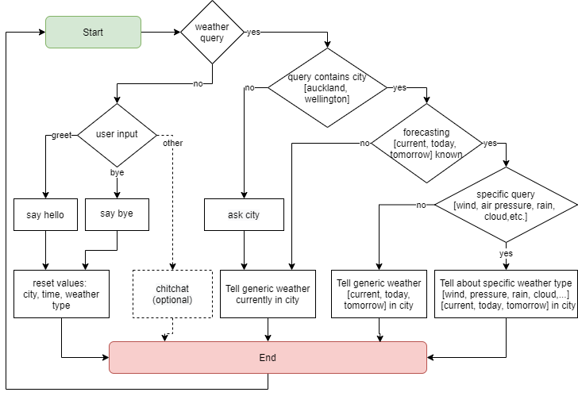

# Weather Chatbot with Rasa 2.0: open source conversational AI

## introduction

As natural language processing (NLP) technology and chatbot systems over the past few years have evolved quickly, also the usefulness of chatbots has increased. The motivation of chatbots is productivity; they have an instant access to information they refer to and are efficient in assisting users. (Brandtzaeg, 2017, *Why people use chatbots*). Weather chatbot is an excellent use case example for the technology.

The content of a chatbot consists of the personality, conversation flows and the information it can deliver to the user. Personality is created by interactions and responses and by acting differently in different situations. These responses should be designed so that it maximises the engagement between the bot and the user (Katz, 2019, *The Ultimate Guide to chatbot personality*, Chatbots Magazine). The weather chatbot described here aims to use these principles, however due to the efforts required, in a rather minimalistic way leaving plenty of room for future improvements. e.g. in the area of how to handle chitchat.

## Weather data

The weather data format chosen here is defined by OpenWeather (https://openweathermap.org/), which provides weather data freely for developers. Auckland, Wellington, and Christchurch data are prefetched for testing purposes, if API use is not wanted for some reason. 


## Conversation Flow

The conversation is initiated by the end-user. A greeting or a goodbye should reset any prior assumptions or knowledge collected by the bot during previous interactions. When time or weather detail are not contained in the query, the bot shall report the current and generic weather conditions. When the city is not provided in the query, the bot shall request for it. Any further specifics in the query should be answered in more detail if information is available. 



*Figure 1: Conversation flow*


## Implementation

All components are defined to support the conversation flow above. The end-user intents here are: **greet, goodbye, weather_in_city, weather_without_city, capabilities, how_are_you and who_are_you**.

In Rasa, the slots can be used for passing information to and back between Rasa and external actions. Three slots are required: **wx_type, city, forecast_period**.

The responses where the personality is also largely created are: **utter_greet, utter_goodbye, utter_ask city** (triggers city_form), **utter_Im_rasa, utter_capabilities, utter_im_well**. This also includes the external action, **action_wx**, which fetches the weather data, parses it and generates the weather forecast sentence.

External actions are user defined functions written in python. Only one action, **action_wx**, is required. It is split in two separate functionalities here: **actions.py** which receives slots: **wx_type, city & forecast_period** from Rasa. It then queries the weather data for specific city from **wx.py** where a function **wx_city(city)** is defined. The function returns the weather data for a specific city in OpenWeatherMap onecall json format to **action_wx**, which then parses it and forms a response sentense to be passed back to Rasa.

The user intents, stories and rules are used for training the NLP model. These intent examples cover tens of different ways of asking questions, and explaining to the model how to find the values for the three slots and what is the intent the user has. The stories contain the conversation flows and rules that will stop any conversation and force a different path. 


## Installation
 
Installation assumes existing installation of miniconda or anaconda. 
https://www.anaconda.com/

### pip & Rasa

Below are the simple steps for creating a virtual environment, install pip and Rasa Open Source 2.0.

```
conda create -n rasa
conda activate rasa
conda install -c anaconda pip
pip install rasa
```
In case of issue, please refer to Rasa Open Source installation pages: 
https://rasa.com/docs/rasa/installation/

### Creating and initialising a new project:

```p
mkdir wxbot
cd wxbot
rasa init --no-prompt
```
This will create a new directlry, under which rasa creates all necessary directories and files.

Replace all files in the wxbot directory with the files in the project.

## Train the model and run the bot

Train the model with command 

```
rasa train
```

There are additional actions that need to be started before starting the bot evaluation. These are in ```actions.py``` and ```wx.py``` files. 

```
rasa run actions
```

Start the discussion with wxbot:

```
rasa shell
```

## Activating OpenWeatherMap API

Should you wish to activate the API, the below needs to be modified in and a valid API key should be inserted in ```wx.py```. API key is available from https://openweathermap.org/

```python
use_openweather_API = True
API_key = "Insert your key here"
```

